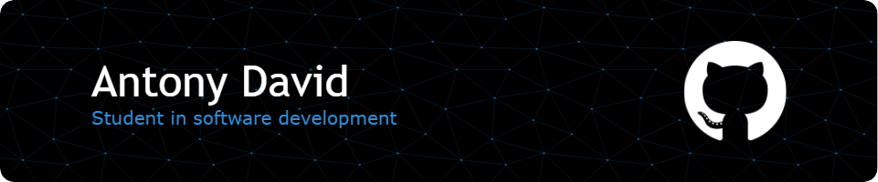

---

#### Projects :

 
<strong>🏢 TeamEase - 2023</strong>

 
  Website, android app and java statistics dashboard for a team building company.&nbsp;

 
<strong>🧩 Sudoku-rust - 2023</strong>

 
  Sudoku generator & solver using the backtracking algorithm, made in Rust with Actix web.&nbsp;
  

 
<strong>:memo: TaskToDo - 2023</strong>

 
  Task planning software project made in C with the GTK+3.2 library, UI is made with Glade.&nbsp;
  

 
<strong>:hamburger: Topcook - 2022</strong>

 
 This is a dynamic website project, the goal is to make a community website about cooking recipes
using PHP & JS. It's also my first year validation project.

 

 

 
 

 
<strong>📈 A star - 2021</strong>

 
C implementation of the [A*](https://en.wikipedia.org/wiki/A*_search_algorithm) search algorithm.
 

 

 
 

 
<strong>:ocean: Survive The Tempest - 2019</strong>

 
This is a game made in python with a friend, a strategy game that we imagined and created from scratch.
You are a castaway on an island in the middle of the sea but a storm is coming... good luck 😇

**Feel free to check out my other repositories, most of them are school projects but some are interesting. 😉**

---

### :man_technologist: About me :

&nbsp;
&nbsp;
&nbsp;
&nbsp;

  

 

  

---

[Jayllyz](https://github.com/Jayllyz)
Last Edited 05/20/2023
